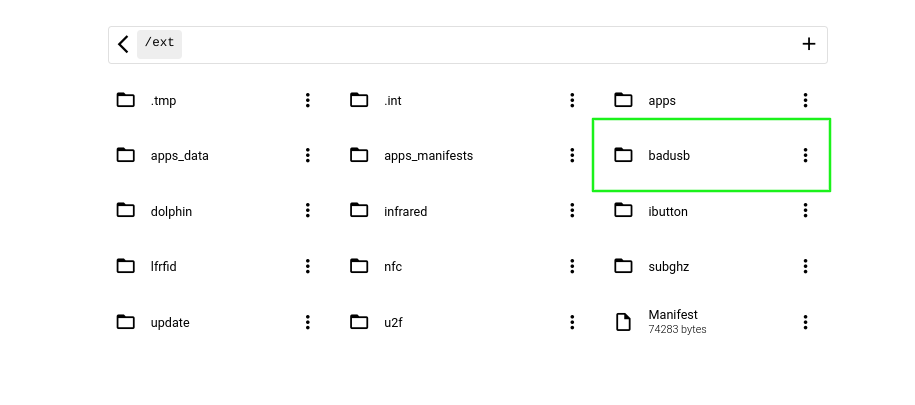
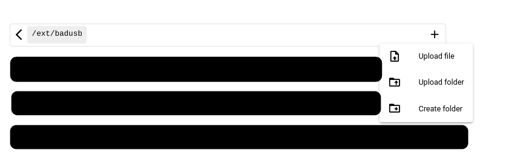
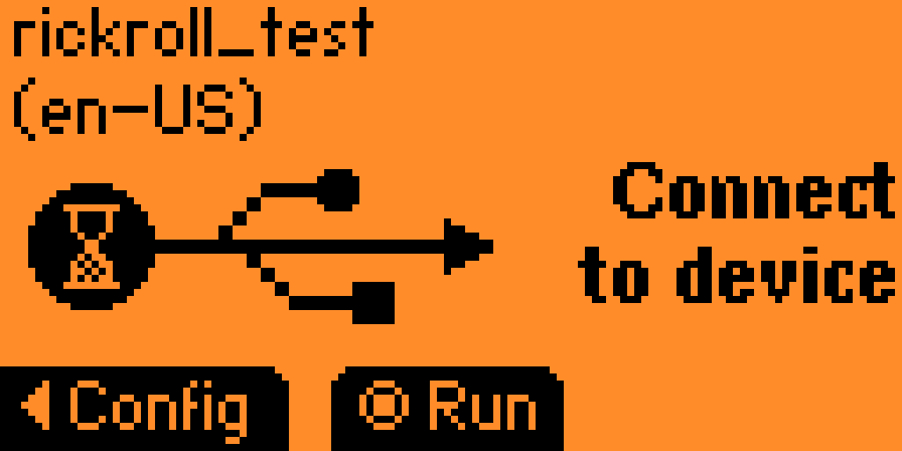

# flipper_badusb
BadUSB codes for the Flippper Zero

## ALL SCRIPTS AVAILABLE:
[Rickroll](./rickroll.txt)

## How to add these scripts to your Flipper Zero?
0. Make sure your flipper is all set up and has a SD card
1. Connect to your flipper: Use the USB cable to connect to qFlipper or [lab.flipper.net](https://lab.flipper.net/)
!! Note: you can **not** access the file system via the Mobile App
2. Go to the file system (https://lab.flipper.net/archive)
3. Go to SD Card, then to **badusb** (/ext/badusb)

4. From there, upload the script. Click on the **+** in the top-right on lab.flipper.net

5. Unplug your Flipper when the upload is done
6. On your flipper, go to **OK > Bad USB** OR **Apps > USB > Bad USB**
7. Select the script you want to execute

8. Plug your Flipper into the target device

9. Press **OK** to execute the script
---
Note: these scripts have been tested on ChromeOS and may not (fully) function on your OS
The creator of this scripts is not responsible for any problems or damage that you run into using these scripts.
Use at own risk, and read the code before you execute it ;)
