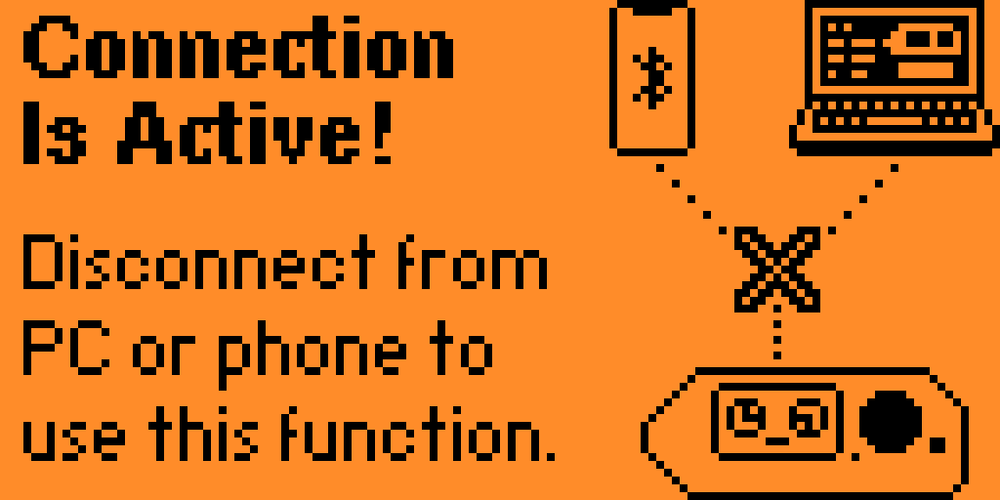

# flipper_badusb
BadUSB codes for the Flippper Zero

## ALL SCRIPTS AVAILABLE:
[Rickroll](./rickroll.txt)
[Fake Apple Update](./FakeScreens/FakeAppleUpdate.txt)
[Fake Windows Blue Screen](./FakeScreens/FakeBlueScreen.txt)
[Fake Ransomware Message](./FakeScreens/FakeRansomware.txt)
[Hackertyper Prank](./FakeScreens/HakcerTyperPrank.txt)
["You are an idiot" website prank](./FakeScreens/idiot_website.txt)

## How to add these scripts to your Flipper Zero?
0. Make sure your flipper is all set up and has a SD card
1. Connect to your flipper: Use the USB cable to connect to qFlipper or [lab.flipper.net](https://lab.flipper.net/)
!! Note: you can **not** access the file system via the Mobile App
2. Go to the file system (https://lab.flipper.net/archive)
3. Go to SD Card, then to **badusb** (/ext/badusb)

4. From there, upload the script. Click on the **+** in the top-right on lab.flipper.net

5. Unplug your Flipper when the upload is done

6. On your flipper, go to **OK > Bad USB** OR **Apps > USB > Bad USB**
7. Select the script you want to execute

8. Plug your Flipper into the target device

9. Press **OK** to execute the script

---

Note: these scripts have been tested on ChromeOS and may not (fully) function on your OS
The creator of this scripts is not responsible for any problems or damage that you run into using these scripts.
DISCLAIMER: These scripts/files/tutorial(s) are intended for educational purposes and awareness training sessions only. Performing hacking attempts on computers that you do not own (without permission) is illegal! Do not attempt to gain access to device that you do not own. Only hack devices you own or have permission for.
Use at own risk, and read the code before you execute it ;)
